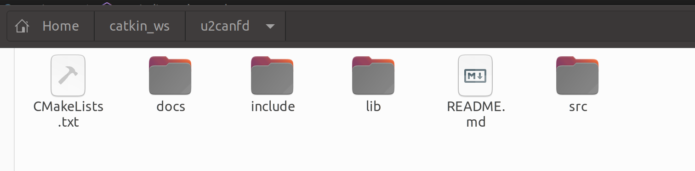
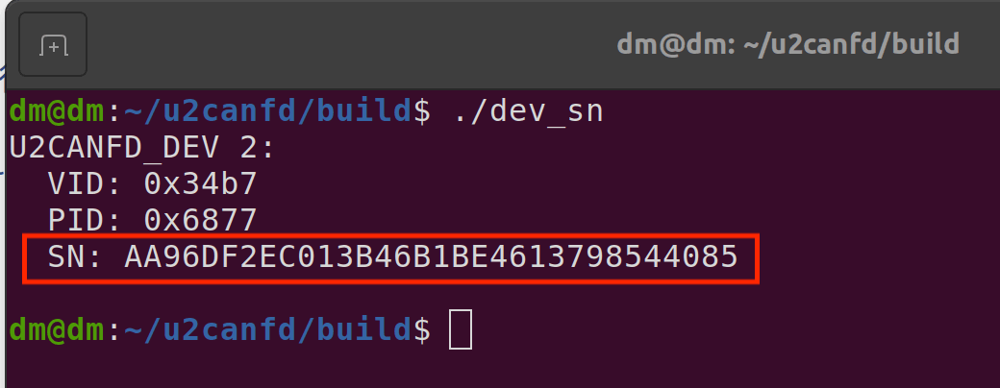
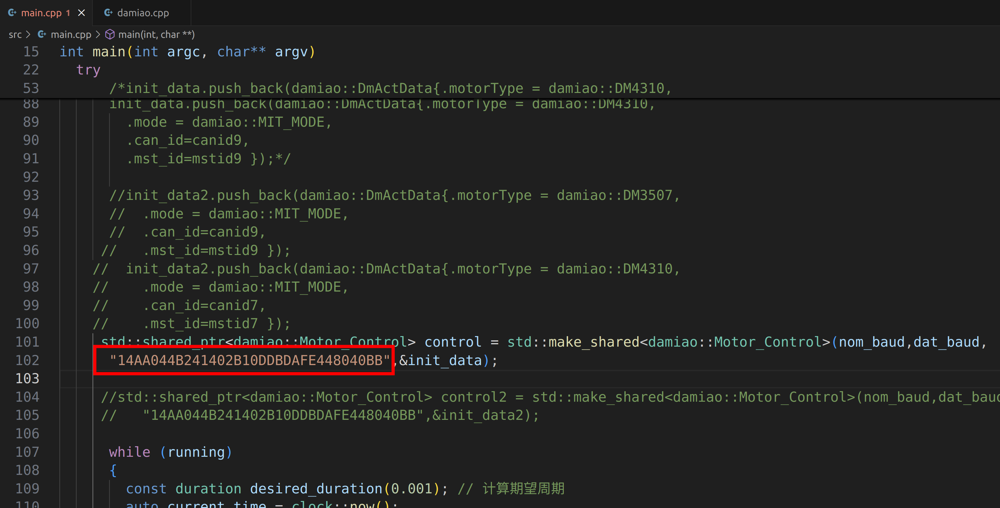

# 使用USB转CANFD驱动达妙电机，c++例程

## 介绍
这是控制达妙电机的c++例程。

硬件设备需要达妙的**USB转CANFD设备**。

程序测试环境是ubuntu20.04,ubuntu22.04。

程序默认运行的效果是先让canid为0x01、mstid为0x11的DM4310电机控制模式设置为速度模式，然后使能，然后旋转，**电机波特率为5M**。

***注意：5M波特率下，电机有多个时，需要在末端电机接一个120欧的电阻***

## 软件架构
使用c++语言，没有用到ros

## 安装和编译
打开终端，先安装libusb库，输入：
```shell
sudo apt update
sudo apt install libusb-1.0-0-dev
```
然后打开终端，输入：
```shell
mkdir -p ~/catkin_ws
cd ~/catkin_ws
```
然后把gitee上的**u2canfd**文件夹放到catkin_ws目录下。

如下所示：



接着打开终端，输入：
```shell
cd ~/catkin_ws/u2canfd
mkdir build
cd build
cmake ..
make
```
## 简单使用
首先用最新上位机给电机设置5M波特率。

然后给**USB转CANFD设备**设置权限，在终端输入：
```shell
sudo nano /etc/udev/rules.d/99-usb.rules
```
然后写入内容：
```shell
SUBSYSTEM=="usb", ATTR{idVendor}=="34b7", ATTR{idProduct}=="6877", MODE="0666"
```
然后重新加载并触发：
```shell
sudo udevadm control --reload-rules
sudo udevadm trigger
```
***注意：这个设置权限只需要设置1次就行，重新打开电脑、插拔设备都不需要重新设置**

然后需要通过程序找到**USB转CANFD设备**的Serial_Number，在你刚刚编译的build文件夹中打开终端运行dev\_sn文件:
```shell
cd ~/catkin_ws/u2canfd/build
./dev_sn
```


上面图片里的SN后面的一串数字就是该设备的的Serial_Number，

接着复制该Serial\_Number，打开main.cpp，替换程序里的Serial\_Number,如下图所示：



然后重新编译，打开终端输入：
```shell
cd ~/catkin_ws/u2canfd/build
make
```

在你刚刚编译的build文件夹中打开终端运行dm_main文件:
```shell
cd ~/catkin_ws/u2canfd/build
./dm_main
```
此时你会发现电机亮绿灯，并且旋转

## 进阶使用
下面手把手教你怎么使用这个程序，实现功能是使用5M波特率，1kHz同时控制9个DM4310电机

***注意：5M波特率下，电机有多个时，需要在末端电机接一个120欧的电阻***

1. 首先用最新上位机给每个电机设置5M波特率。

2. 然后在main函数里定义id变量：
```shell
uint16_t canid1 = 0x01;
uint16_t mstid1 = 0x11;
uint16_t canid2 = 0x02;
uint16_t mstid2 = 0x12;
uint16_t canid3 = 0x03;
uint16_t mstid3 = 0x13;
uint16_t canid4 = 0x04;
uint16_t mstid4 = 0x14;
uint16_t canid5 = 0x05;
uint16_t mstid5 = 0x15;
uint16_t canid6 = 0x06;
uint16_t mstid6 = 0x16;
uint16_t canid7 = 0x07;
uint16_t mstid7 = 0x17;
uint16_t canid8 = 0x08;
uint16_t mstid8 = 0x18;
uint16_t canid9 = 0x09;
uint16_t mstid9 = 0x19;
```
3. 然后定义USB转CANFD波特率：

```shell
uint32_t nom_baud =1000000;//仲裁域1M波特率
uint32_t dat_baud =5000000;//数据域5M波特率
```
4. 然后定义一个电机信息容器：
```shell
std::vector<damiao::DmActData> init_data;
```
5. 然后再用9个电机数据对该容器进行填充：
```shell
init_data.push_back(damiao::DmActData{.motorType = damiao::DM4310,
                                            .mode = damiao::MIT_MODE,
                                            .can_id=canid1,
                                            .mst_id=mstid1 });

init_data.push_back(damiao::DmActData{.motorType = damiao::DM4310,
        .mode = damiao::MIT_MODE,
        .can_id=canid2,
       .mst_id=mstid2 });

init_data.push_back(damiao::DmActData{.motorType = damiao::DM4310,
       .mode = damiao::MIT_MODE,
        .can_id=canid3,
        .mst_id=mstid3 });

init_data.push_back(damiao::DmActData{.motorType = damiao::DM4310,
        .mode = damiao::MIT_MODE,
        .can_id=canid4,
        .mst_id=mstid4 });
 
init_data.push_back(damiao::DmActData{.motorType = damiao::DM4310,
        .mode = damiao::MIT_MODE,
        .can_id=canid5,
        .mst_id=mstid5 });

init_data.push_back(damiao::DmActData{.motorType = damiao::DM4310,
        .mode = damiao::MIT_MODE,
        .can_id=canid6,
        .mst_id=mstid6 });
      
init_data.push_back(damiao::DmActData{.motorType = damiao::DM4310,
        .mode = damiao::MIT_MODE,
        .can_id=canid7,
        .mst_id=mstid7 });

init_data.push_back(damiao::DmActData{.motorType = damiao::DM4310,
        .mode = damiao::MIT_MODE,
        .can_id=canid8,
        .mst_id=mstid8 });

init_data.push_back(damiao::DmActData{.motorType = damiao::DM4310,
        .mode = damiao::MIT_MODE,
        .can_id=canid9,
        .mst_id=mstid9 });
```
6. 然后初始化电机控制结构体：
```shell
std::shared_ptr<damiao::Motor_Control> control = std::make_shared<damiao::Motor_Control>(nom_baud,dat_baud,
      "AA96DF2EC013B46B1BE4613798544085",&init_data);
```
***注意：上面的"AA96DF2EC013B46B1BE4613798544085"是我设备的SN号，你要替换为你的SN号，通过运行dev_sn文件就可以找到你设备的SN号，前面也提到过***

7. 接下来就可以通过该结构体对电机进行控制，给9个电机发mit命令：
```shell
control->control_mit(*control->getMotor(canid1), 0.0, 0.0, 0.0, 0.0, 0.0);
control->control_mit(*control->getMotor(canid2), 0.0, 0.0, 0.0, 0.0, 0.0);
control->control_mit(*control->getMotor(canid3), 0.0, 0.0, 0.0, 0.0, 0.0);
control->control_mit(*control->getMotor(canid4), 0.0, 0.0, 0.0, 0.0, 0.0);
control->control_mit(*control->getMotor(canid5), 0.0, 0.0, 0.0, 0.0, 0.0);
control->control_mit(*control->getMotor(canid6), 0.0, 0.0, 0.0, 0.0, 0.0);
control->control_mit(*control->getMotor(canid7), 0.0, 0.0, 0.0, 0.0, 0.0);
control->control_mit(*control->getMotor(canid8), 0.0, 0.0, 0.0, 0.0, 0.0);
control->control_mit(*control->getMotor(canid9), 0.0, 0.0, 0.0, 0.0, 0.0);
```
8. 获取9个电机的位置、速度、力矩还有接收到电机反馈的数据的时间间隔：
```shell
for(uint16_t id = 1;id<=6;id++)
{
  float pos=control->getMotor(id)->Get_Position();//电机实际位置
  float vel=control->getMotor(id)->Get_Velocity();//电机实际速度
  float tau=control->getMotor(id)->Get_tau();//电机输出力矩
  double interval=control->getMotor(id)->getTimeInterval() ;//接收到电机反馈的数据的时间间隔
  std::cerr<<"canid is: "<<id<<" pos: "<<pos<<" vel: "<<vel
          <<" effort: "<<tau<<" time(s): "<<interval<<std::endl;
}
```
9. 1kHz的控制频率实现：

***注意：使用这函数std::this_thread::sleep_until(sleep_till)比较好***
```shell
while (1) 
{ 
  const duration desired_duration(0.001); // 计算期望周期
  auto current_time = clock::now();


  const auto sleep_till = current_time + std::chrono::duration_cast<clock::duration>(desired_duration);
  std::this_thread::sleep_until(sleep_till);    
}
```
## 接收函数说明

在damiao.cpp里的void Motor\_Control::canframeCallback(can\_value_type& value)，

这个函数是对接收到的can报文的解析，不能主动调用，他是作为参数传入到usb_class这个类，在usb\_class类里会开启线程调用该函数，

你可以重写这个函数解析自己的can报文数据
